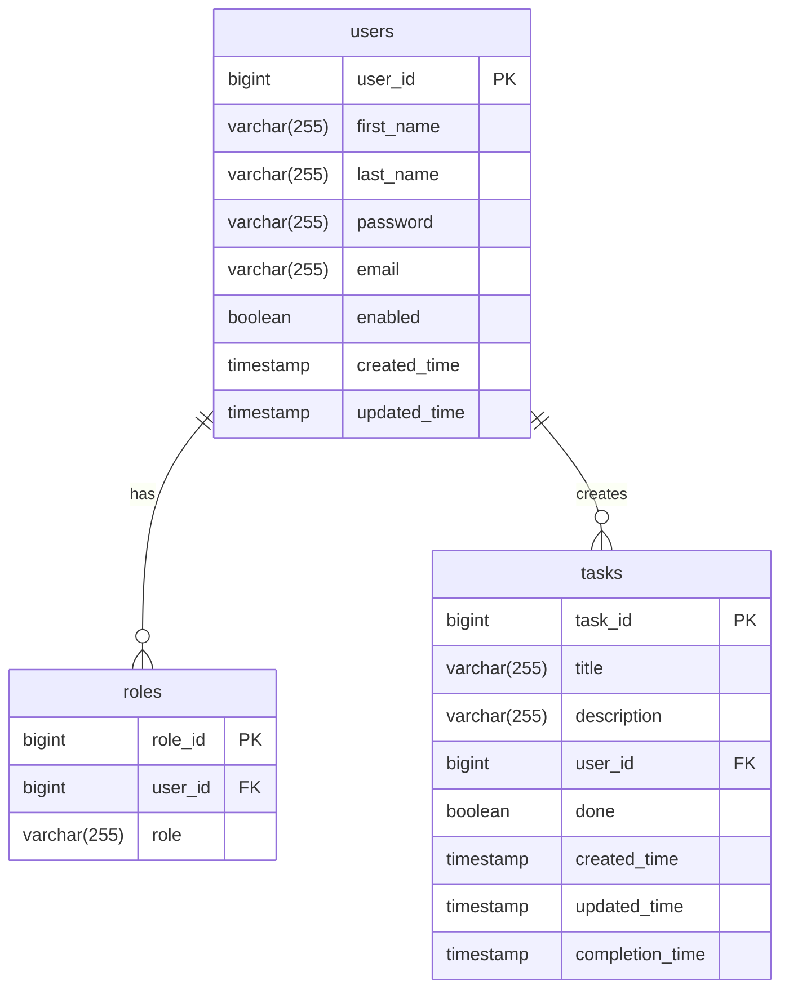

# Multiuser Task Scheduler 🚀

*A web application for multi-user task management*

## 📌 Table of Contents
- [Key Features](#-key-features)
- [Tech Stack](#-tech-stack)
- [API Documentation](#-api-documentation)
- [Database Schema](#-database-schema)
- [Quick Start](#-quick-start)
- [Testing](#-testing)
- [Deployment](#-deployment)
- [Contacts](#-contacts)

## 🌟 Key Features
### User Management:
- ✅ Registration and authentication (JWT)
- 🔐 Role-based access control
  
### Task Management
- ➕ Create/edit tasks
- ✔️ Mark tasks as completed
- 🗑️ Delete tasks

### Smart Notifications
- ✉️ Welcome email
- 🔔 Daily midnight email reminders:
  - Summary of completed tasks
  - Upcoming tasks

## 🛠 Tech Stack
| Category       | Technologies                          |
|----------------|-----------------------------------|
| **Backend**     | Java 17, Spring Boot 3, Web, Data JPA, Security, Cloud, Kafka, Scheduler, Mail|
| **Database**| PostgreSQL, Liquibase             |
| **Infrastructure** | Docker, Docker Compose       |
| **Build Tool**     | Maven|
| **Testing** | JUnit 5, Mockito, Testcontainers |

## API Documentation

[](https://documenter.getpostman.com/view/41252659/2sB2cPjk5v)

## 📊 Database Schema



## ⚡ Quick Start
1. Clone repository:
```bash
git clone https://github.com/LoucterSo/multi-user-task-scheduler
```
2. Configure environment variables in `docker-compose-dev.yml`:
```yaml
environment:
  SPRING_MAIL_USERNAME: "your_email@example.com"    # Email for sending notifications
  SPRING_MAIL_PASSWORD: "your_app_password"         # Application password (not your main account password)
  JWT_SECRET: "your_secure_jwt_secret_here"         # Secret key for JWT tokens
```

3. Start the application:
```bash
docker-compose -f docker-compose-dev.yml up --build
```

4. Stop the application:
```bash
docker-compose -f docker-compose-dev.yml down
```

## 🧪 Testing
```bash
# Unit-tests in a service
./mvnw test
```

## 🐳 Deployment
### 1. Local execution (without Docker):
- application-local.yaml
### 2. Development mode:
```bash
docker-compose -f docker-compose-dev.yml up --build
```
### 3. Production mode:
*Do not forget to add the .env file with the necessary properties to the root of the project*
```bash
docker-compose -f docker-compose-prod.yml up --build
```

## 📧 Contacts
- Author: Vladislav Gorelkin
- 📧 Email: vlad_gorelkin@inbox.ru | loucterso@gmail.com
- 💻 GitHub: [LoucterSo](https://github.com/LoucterSo)

