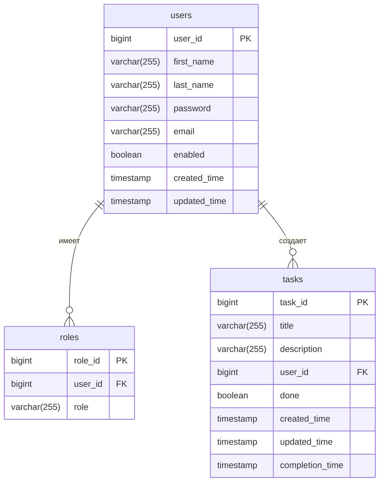

# Multiuser Task Scheduler 🚀

*Веб-приложение для управления задачами с многопользовательским доступом*

## 📌 Содержание
- [Основные функции](#-основные-функции)
- [Технологический стек](#-технологический-стек)
- [Схема базы данных](#-схема-базы-данных)
- [Быстрый старт](#-быстрый-старт)
- [Тестирование](#-тестирование)
- [Развертывание](#-развертывание)
- [Контакты](#-контакты)

## 🌟 Основные функции
### Работа с пользователями:
- ✅ Регистрация и авторизация (JWT)
- 🔐 Ролевая модель доступа
  
### Работа с задачами
- ➕ Создание/редактирование задач
- ✔️ Пометка задачи как сделанной
- 🗑️ Удаление задач

### Умные оповещения по почте
- ✉️ Приветственное письмо
- 🔔 Напоминания каждый день в полночь:
  - Задачи выполненные за день
  - Задачи на будущее

## 🛠 Технологический стек
| Категория       | Технологии                          |
|----------------|-----------------------------------|
| **Бэкенд**     | Java 17, Spring Boot 3, Web, Data JPA, Security, Cloud, Kafka, Scheduler, Mail|
| **Базы данных**| PostgreSQL, Liquibase             |
| **Инфраструктура** | Docker, Docker Compose       |
| **Сборка**     | Maven|
| **Тестирование** | JUnit 5, Mockito, Testcontainers |

## 📊 Схема базы данных



## ⚡ Быстрый старт
1. Клонируйте репозиторий:
```bash
git clone https://github.com/LoucterSo/multi-user-task-scheduler
```
2. Настройка окружения в `docker-compose-dev.yml`:
```yaml
environment:
  SPRING_MAIL_USERNAME: "your_email@example.com"    # Email для отправки уведомлений
  SPRING_MAIL_PASSWORD: "your_app_password"         # Пароль приложения (не аккаунта!)
  JWT_SECRET: "your_secure_jwt_secret_here"         # Секретный ключ для JWT
```
3. Запуск приложения:
```bash
docker-compose -f docker-compose-dev.yml up --build
```
4. Остановка приложения:
```bash
docker-compose -f docker-compose-dev.yml down
```

## 🧪 Тестирование 
```bash
# Unit-tests в сервисе
./mvnw test
```

## 🐳 Развертывание
### 1. Для запуска локального запуска(без Docker):
- application-local.yaml
### 2. В режиме разработки:
```bash
docker-compose -f docker-compose-dev.yaml up
```
### 3. В режиме продакшена:
*Не забудь добавить .env файл с нужными значениями в корень проекта*
```bash
docker-compose -f docker-compose-prod.yaml up
```

## 📧 Контакты
- Автор: Владислав Горелкин
- 📧 Email: vlad_gorelkin@inbox.ru | loucterso@gmail.com
- 💻 GitHub: [LoucterSo](https://github.com/LoucterSo)

