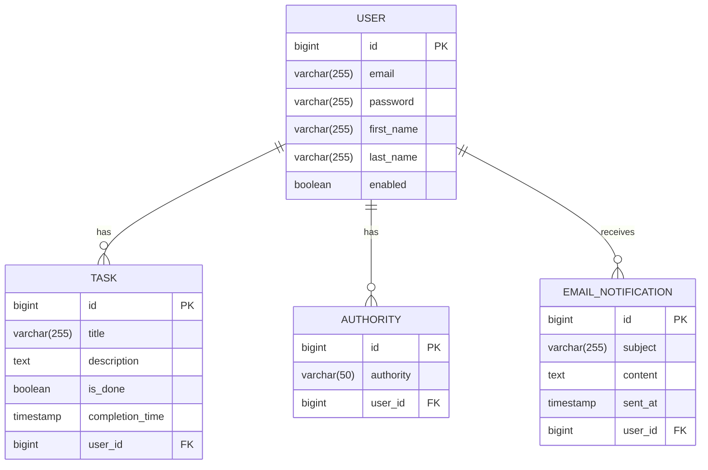

```mermaid
erDiagram
    USER ||--o{ TASK : "has"
    USER {
        bigint id PK
        varchar(255) email
        varchar(255) password
        varchar(255) first_name
        varchar(255) last_name
        boolean enabled
    }
    
    TASK {
        bigint id PK
        varchar(255) title
        text description
        boolean is_done
        timestamp completion_time
        bigint user_id FK
    }
    
    USER ||--o{ AUTHORITY : "has"
    AUTHORITY {
        bigint id PK
        varchar(50) authority
        bigint user_id FK
    }
    
    USER ||--o{ EMAIL_NOTIFICATION : "receives"
    EMAIL_NOTIFICATION {
        bigint id PK
        varchar(255) subject
        text content
        timestamp sent_at
        bigint user_id FK
    }
```
